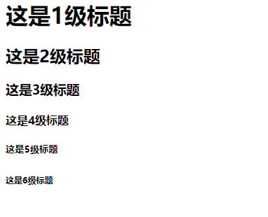
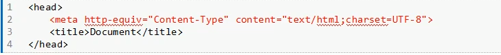
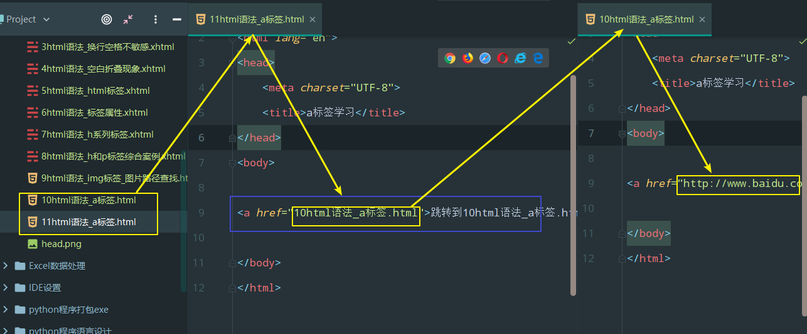

前端学习

## HTML学习


### 互联网原理

> 1.html:制作网页
>
> 2.互联网原理:上网即请求数据

- 原理描述

  在**浏览器**输入一个网址,浏览器会通过**http协议**向**服务器**发送请求,服务器响应后,将文件传输到浏览器端,过程中有实际的物理文件的传输

  > 传输的数据包括:**文字,图片,视频,音频**

#### 服务器

> 1.本身也是一台计算机
>
> 2.服务器英文名:server,功能和配置要比普通计算机要强大,主要用于存储网页文件和数据
>
> ​	数据上传和更改是在本地计算机上完成的,通过一些管理软件远程控制服务器器,如:FTP
>
> ​	服务器要求24小时开机,保障用户可以随时访问数据

#### 浏览器

- 网页请求和接收的客户端

- 浏览器英文名:browser,客户端是渲染网页使用的软件

- 浏览器的作用:发起http请求,接受服务器传输文件

- 浏览器五大品牌,它们有不同的厂商来维护,有很多品牌和版本

  > 谷歌(chrome)
  >
  > 火狐(Firefox)
  >
  > 欧朋(opera)
  >
  > IE
  >
  > 苹果(safari)

  ​	   

- 每个浏览器都有不同的版本:功能越来越完善,旧的浏览器淘汰过程跟不上更新速度
- 不同浏览器版本渲染网页的能力不同,用户浏览的效果也不一样
- 后期开发是,兼容低版本的用户,需要做兼容书写
- 请求的数据并不是在浏览器软件上,而是存在本地计算机临时文件(也称之为:**缓存文件**),谷歌浏览器的临时文件路径如下:
  1. 在谷歌浏览器输入窗口输入:**chrome://version**
  
  2. 找到**个人资料路径**
  
  3. C:\Users\Administrator\AppData\Local\Google\Chrome\User,粘贴到文件窗口地址,然后去掉\Chrome\User确定
  
  4. 找到C:\Users\Administrator\AppData\Local\Google\Chrome\User Data\Default\下面的两个目录
  
  5. 两个目录名为:**Cache和Code Cache目录**,这两个目录中就是缓存文件
  
     > 临时文件夹**作用**:临时存储网页文件,任何网址第二次打开的时候速度都会变快
     >
     > **原因**:就是第一次打开网站时,已经将大部分的文件缓存到本地计算机了

#### http协议

> **http英文**:hypertext transfer protocol
>
> **http中文意思**:超文本传输协议

- **http协议包含两个部分**

  - 请求**(request)**

    > 浏览器根据网址向对应服务器发送请求

    - 发起请求的方法
      - 在浏览器上输入网址,或者点击网址链接

  - 响应**(response)**

    > 服务器根据请求响应文件,将页面传输给到客户端,在浏览器中进行网页渲染

  - 注意

    > 访问页面时，会同时发出多个http请求，包含网页的图片、视频、音频等文件

  - google浏览器控制台查看**请求**和**响应**方法

    - 快捷键打开浏览器控制台面板：**F12键**

    

    

------


###  HTML基础

#### 纯文本

> 1. 纯文本：只包含文字，**诠释**：如果一个文件内部只包含文字，就是纯文本文件
>
>    1. 最简单的案例：记事本，.txt后缀是text缩写，**一个汉字2个字节**
>
>    > txt文本样式设置之后（加粗，字体），只是在本机显示的一个状态，不会保存在文件里，其它计算机查看时，就是默认的一个显示状态
>
>    
>
> 2. 可以通过扩展名直接更改文件类型
>
>    - 显示和隐藏扩展名不同的系统不同的设置方法，自行百度
>
> 3. 我们所学习的**HTML,CSS,JS**都是**纯文本文件**
>
> 4. 纯文本文件都能够用任意的纯文本编辑器进行编辑，比喻你可以用记事本编写代码

#### HTML基本概念

> **HTML：**英文名（**hypertext markup language**）中文：**超文本标记语言**，是用来**描述网页的一种语言**
>
> **作用：**负责描述文档语义的语言
>
> *<u>HTML就是用文本来描述文本的语义，所用到的文本即超文本，超文本在浏览器渲染时不显示</u>*
>
> <u>*HTML不负责修改文本的样式，只是通过标签给文本增加语义*</u>
>
> **常见问题：**h1标签的作用是什么？
>
> > **答案:**并不是将文字加粗加大,自己独占一行,**真正的作用是**:添加了一个一级标题的语义,真正的样式是有CSS来控制
> >
> > **截图说明**
> >
> > 
> >
> > **截图代码说明：**
> >
> > ```html
> > <h1></h1>   <!--注释：将两个标签内部的文本添加了一个一级标题的语义-->
> > <h2></h2>   <!--注释：将两个标签内部的文本添加了一个二级标题的语义-->
> > <p><//p>   <!--注释：将两个标签内部的文本添加了一个段落的语义-->
> > ```
> >
> > **注意：**我们要知道一个概念**上面截图**的样式**并不是HTML标签**给我们添加的**而是CSS添加的**


#### 代码编辑器

- 编辑器软件
  1.  Dreamweaver
  2. Sublime：高效程序书写工具
  3. webstorm：高级项目编写工具

> Sublime：超群的，崇高的

- 快捷键
  1. ctrl+滚轮：放大缩小文字
  2. shift+ctrl+D：复制光标所在行
  3. shift+ctrl+K/ctrl+X：删除光标所在行
  4. shift+ctrl+方向上键：上移当前行
  5. shift+ctrl+方向下键：下移当前行
  6. 标签名——>tab：自动生成标签对
  7. html:xt——>ctrl+E：自动生成HTML文档结构

### HTML结构


#### HTML骨架

```html
基本骨架:
<html>
    	<head>
            <title>标题</title>
            
    	</head>
    
    	<body>
            内容
    	</body>
</html>

```

> **html:**最根本的标签,表示整个网页

> **head:**网页头部,里面都是一些网页的配置,除了title标签,其它的内容在浏览器上都是不可见的

> **title:**网页的标题

> **body:**用户能够看到的内容区域

> **截图说明:**
>
> 

####  文档DTD

- DTD

  > 1. HTML文件的第一行内容叫做文档定义类型,英文:Do'cType Definition,简称:DTD,也称作**"文档声明类型"**
  > 2. 作用:告知浏览器该网页使用的是哪种HTML规范,规范了我们使用的标签语法
  > 3. HTML，CSS，JS规范的维护和制定的组织是:**W3C**
  > 4. W3C的中文网站是：
  > 5. 严格程度
  >    - XHTML1.0 Strict—>HTML4.01 Strict——>XHTML1.0 Transitionl——>HTML4.01 Transitionl
  >    - HTML4.0版本，将结构和样式进行了分离。**常用的HTML4.01版本**
  >      - **XHTML1.0在4.01版本基础上进行严格化和扩展升级，严格规定标签必须小写，属性必须用双引号包裹，结束标签的关闭符号/必须写**
  >    - 两个规范下面分别包含3个小规范
  >      - Strict  严格版：不能使用font等废弃标签，不能使用框架集，结构和样式分离
  >      - Transitionl 过渡版（通用版）：可以使用font等废弃标签，不能使用框架集
  >      - Frameset 框架集版：可以使用框架集
  >      - **我们最常用的版本为：XHTML1.0Transitionl**
  >      - HTML版本发展到HTML5,不再区分3个小规范，**该规范在不同的浏览器中存在兼容问题**
  >      - HTMT5的DTD进行了极大的简化：<!DOCTYPE html>
  >
  > > **总结：所以文档DTD的作用是：规范我们所使用HTML的版本**
  
  

#### html标签

```html
<html xmlns="http://www.w3.org/1999/xhtml" xml:lang="en">

</html>
```

> html 标签是一个双标签
>
> 双标签：有开始标签和结束标签。必须是成对出现
>
> html有两个属性：
>
> - xmlns：是xml的namespace规定了我们的标签使用的是哪种命名规范。用户浏览器不一致，必须规范死什么是标签什么是内容
> - lang:规定我们html文件标签都必须使用的是英文

####  head标签

> head标签也是一对双标签，里面是对我们网页进行的一个配置

- head标签截图

  

  - meta标签：它是一个单标签

  - 红色meta标签规范的是我们网页使用的字符集

    

  - 常用的字符集
    - ​	国际标准字库（全球通用）：UTF-8,包括了世界上所有人类的语言，在UTF-8字符集中**中文占3个字节**，注意区分：**上面的笔记中记录的是中文字符在文本文件中占的是2个字节，**
    - 国家标准字库（中国通用）：GB2312或者叫GBK,包括所有的简体，大部分繁体，还有一些特殊字符，**中文占2个字节**

  - 使用情况

    - 如果是制作外文网站，使用UTF-8
    - 如果网站中有大量中文，且要求加载速度，使用GBK

    > **<u>注意:meta标签声明的字库,必须和软件默认保存字库相同,否则会出现乱码</u>**

#### title标签

> 1. title标签是一个双标签,内部书写的网页的标题
> 2. 它还可以做搜索引擎优化:SEO,提升我们搜索排名
> 3. title里的文字会作为关键字首先被搜索引擎抓取

### html语法

> 

#### 标签对换行和空格不敏感 


> 1.在编辑html的时候，标签之间对换行和空格不敏感，**对标签之间的嵌套敏感**
>
> 2.为了保证我们代码的可读性强，需要对我们的标签进行合理化的**缩进**
>
> 

#### 空白与折叠现象

> > **下面的代码有很多空格**，但其实在浏览器上显示的时候，只能显示一个空格
> >
> > 
> >
> > 
> >
> > **浏览器展示效果**
> >
> > 
> >
> > 
> >
> > **空格的真正实现**
> >
> > <!--需要在代码块中加上&nbsp;-->
> >
> > 

#### html标签概括

> 标签也叫**标记**

1. 标签必须写在一对尖括号里<p>

2. 双标签必须成对出现

   ```hmtl
   <body>
   <h1>这是标题   #这里少写一个结束标签：/h1,那么在浏览器中展示时会有报错提示，也会影响后面的标签，成对的标签一定要成对出现
   <p>这是段落</p>
   </body>
   ```

3. 结束标签必须写关闭符号**/**

4. 标签的分类

   1. 容器级
      - 内部还可以放置嵌套任意类型标签，甚至是容器级标签，如：div，h系列
   2. 文本标签
      - 只能放文字、图片、表单元素，废弃文字修饰标签等，**不能放容器级标签**，如：p标签

5. 标签属性

   - 每个标签都有自己特定的属性

     1. 属性书写在标签的起始标签内部，与标签名用空格隔开，属性与属性之间也需要用空格隔开

   - 属性都有属性值

     > 属性名k(key),属性值v(value),键值对写法

     1. 键值对书写格式：k=“v”，中间不能有空格，如下面：**class=“duanluo”空格id=“op”**这样就增加了两个属性

        ```html
        <p class="duanluo" id="op">这是段落</p>
        ```

        <u>注意：一个标签可以有多个属性，多个属性值之间用空格隔开，全部必须在引号内部</u>

     2. 属性值必须是双引号包裹，XHTML严格要求用双引号

### html标签分类

- 本章截图

  

  

#### h系列

- **h标签英文：headline,标题的缩写，容器级标签**

> - h系列标签分为了6个等级，表示1到6级标题
>
> ```html
> <body>
> <h1>这是1级标题</h1>
> <h2>这是2级标题</h2>
> <h3>这是3级标题</h3>
> <h4>这是4级标题</h4>
> <h5>这是5级标题</h5>
> <h6>这是6级标题</h6>
> </body>
> ```
>
> - 展示效果	
>
>   
>
>   根据级别依次降低，重要程度也是依次降低
>
>   
>
>   **注意：一般一个页面里面h1标签的权重是最高的，最便于搜索引擎搜索的，一个页面只写一个h1标签**
>
>   **一般将h1这个标签给logo**
>
> - h1标签没有嵌套关系
>
>   > 所有的h标签虽然是容器级，但是它们之间并没有嵌套关系

#### p标签

- **p标签英文：paragraph,段落的缩写，文本级标签**
- **内部只能放置文本、图片、表单元素、或者废弃的font标签等**
- <u>**<span style='color:green'>一个p标签只用作用于一个段落。多个段落要用多个标签分别标记</span>**</u>

#### img标签

- 截图

  

- image标签

  > 是图片的缩写，表示定义一个图像，相当于一个特殊的文本，可插入图片的类型：jpg、png、git

- img是一个单标签

  > 

  

- img标签的属性

  > - src   source表示图片的路径，**<span style='color:green'>这个是必须写的属性</span>**
  >
  >   - 路径 ：就是我们需要查找相关文件的位置方法，查找方式有两种：
  >
  >     1. **相对路径**：查找文件时，从html文件本身出发，找文件的位置，查找时又分为两种查找方式
  >
  >        1. **<span style='color:green'>同级查找：</span>**就是这个html文件和图片在同一个文件夹下，查找时：直接书写文件名字（包括文件名和扩展名）
  >
  >           **文件完成路径：E:\xianmingyu\20前端学习\head.png**
  >
  >           ```html
  >           <body>
  >           
  >           </body>
  >           ```
  >
  >           
  >
  >        2. **<span style='color:green'>子级查找：</span>**进入文件查找过程，书写对应文件夹的名字，后面用/表示进入文件夹，然后后面直接书写制定的文件名称并带上文件后缀
  >
  >           **文件完整路径：E:\xianmingyu\20前端学习\1笔记素材\h系列6级标签.png**
  >
  >           ```html
  >           <body>
  >           
  >           </body>
  >           ```
  >
  >           
  >
  >        3. **<span style='color:green'>上级查找：</span>**文件放在html上级的文件夹里，需要退回到上一级文件夹，方法就用../退回，退出几级就书写几次
  >
  >           **文件完成路径：E:\xianmingyu\前端学习_上级查找图片测试\head.png**
  >
  >           ```html
  >           <body>
  >           
  >           </body>
  >           ```
  >
  >        > **注意：**
  >        >
  >        > - **<span style='color:green'>../是从儿子目录退回到父亲目录,如果要从儿子目录退回到爷目录输入两次../../</span>**
  >        > - **<span style='color:green'>相对路径不能跨盘符进行查找</span>**
  >        >
  >        > 
  >
  >     2. **绝对路径**
  >
  >        > 绝对路径查找(目前学习是在百度搜索的图片然后把图片地址复制过来，然后在浏览器显示没有问题，但是添加本地文件的绝对路径时在浏览器上预览无显示，后续再练习)
  >
  >        
  >
  >        1. **绝对路径是从盘符出发寻找目标文件，以http://开头的路径也是绝对路径**
  >
  >        2. 在实际的工作当中，不推荐使用从盘符出发的绝对路径，因为它不可移植，不可移动
  >
  >        3. 绝对路径的使用方式特别简单，我们只需要将图片丢入在浏览器地址栏中会显示图片的绝对路径，直接复制粘贴这个路径即可
  >
  >           ```html
  >           <body>
  >                      image&quality=80&size=b9999_10000&sec=
  >           1582558149968&di=f07609248d4d6da9c2e6933513b25bbd&imgtype=0&
  >           src=http%3A%2F%2Fb-ssl.duitang.com%2Fuploads%2Fitem%2F201706%2F14%2F20170614141306_eB35C.jpeg" alt=""/>
  >           </body>
  >           ```
  >
  >           **注意：网络图片的地址一定要正确，如下百度图片的地址**
  >
  >           
  >
  >     - **总结**
  >
  >       > **常用：相对路径和网址形式的绝对路径**
  >
  >       
  >
  > - width  表示图片的宽度
  >
  >   ```html
  >   <!-- 图片的宽度设置 width是设置图片的宽度"-->
  >   <body>
  >   
  >   </body>
  >   ```
  >
  >   > **width:**宽度。单位是：px，可以省略单位，单独设置宽度，高度会等比例变换
  >
  >   
  >
  > - height  表示图片的高度
  >
  >   ```html
  >   <!-- 图片的宽度设置 height是设置图片的高度"-->
  >   <body>   
  >   
  >   </body>
  >   ```
  >
  >   > **height:**高度。单位是：px，可以省略的单位，单独设置高度，**宽度会等比例变换**
  >
  >   > **同时设置宽和高，可以对图片任意变形**
  >
  >   
  >
  > - border 边框属性；它的值可以设置边框的厚度
  >
  >     ​	**暂无讲解**
  >
  >   
  >
  > - title   设置提示文本
  >
  >   ```html
  >   <!--title是设置图片的文本提示，我们在浏览器中把鼠标悬停在图片上
  >   就会提示“这是一只狗"-->
  >   <body>
  >   
  >   </body>
  >   ```
  >
  >   
  >
  > - alt     设置图像没有找到时候的替换文本
  >
  >   ```html
  >   <!--  alt 设置图像没有找到时候的替换文本-->
  >   <body>
  >   
  >   </body>
  >   
  >   ```
  >
  >   浏览器在预览的时候，如果图片没有找到就会提示上面alt中设置好的信息**“这个图片没有找到”**
  >
  >   

  

#### a标签

- 截图

  

- a标签英文名：anchor “锚“ **超级链接的缩写**，可以跳转到相应的网站

- a标签是一个双标签

- a标签的属性

  - href：hypertext reference 超文本引用，值为跳转链接的地址，**地址为绝对路径**

    - ```html
      <body>
      <a href="http://www.baidu.com">跳转到百度</a>
      </body>
      ```

    - 浏览器展示截图

      

    - **相对路径跳转**

      >- 案例：有两个html文件，分别是：**10html语法_a标签.html 和 11html语法_a标签.html**
      >
      >  首先在**10html语法_a标签.html**这个文件当中设置一个绝对路径超级链接到百度，然后在**11html语法_a标签.html**这个文件当中把<u>10html语法_a标签.html</u> **设置为相对路径**，到我们在浏览器中预览**11html语法_a标签.html**的时候，点击“<u>跳转到10html语法_a标签</u>”，然后再点击“跳转到百度”
      >
      >
      >
      >
      >
      >```html
      ><!--  10html语法_a标签.html-->
      ><body>
      ><a href="http://www.baidu.com">跳转到百度</a>
      ></body>
      >```
      >
      >```html
      ><!-- 11html语法_a标签.html -->
      ><body>
      >   <a href="10html语法_a标签.html">跳转到10html语法_a标签.html</a>
      ></body>
      >```

    - **点击图片跳转到指定网址**

      > 点击“**a标签相对路径地址跳转.png**”，**然后跳转到"http://www.163.com"网址**

      

      ```html
      <body>
          <a href="http://www.163.com"> </a>
      </body>
      ```

    - **页面之间相互跳转**

      > 分别在两个html文件当中设置对应文件的超级链接

      

      ```html
      <!--  在10html语法_a标签.html文件当中设置11html语法_a标签.html文件的超链接-->
      
      <body>
         <a href="11html语法_a标签.html">跳转到11html语法_a标签.html</a>
      </body>
      
      ```

      ```html
      <!--  在11html语法_a标签.html文件当中设置10html语法_a标签.html文件的超链接-->
      
      <body>
         <a href="10html语法_a标签.html">跳转到10html语法_a标签.html</a>
      </body>
      ```

      

    

  - target：表示是否在新标签页打开链接，属性值”_blank“表示在新窗口打开

    > 是否在新标签页打开链接
    >
    > ```html
    > <body>
    >     
    > <!--target属性 -->
    >     <!-- 当target等于_blank时表示在新窗口打开网页 -->
    > <a href="http://baidu.com" target="_blank">打开百度链接</a>
    >     
    > </body>
    > ```
    >
    > 

  - title：设置鼠标悬停文本

    ```html
    <body>
    <!-- title 属性-->
    <a href="http://www.163.com" target="_blank" title="这是网易的网站">打开网易链接</a>
    </body>
    ```

    **展示效果：**当鼠标悬停在”打开网易链接“上时，会有”这是网易的网站“文本提示

    ​	

- **页面内锚点跳转**

  - 通过标签的name，id属性跳转

    - 给对应位置的标签添加一个id属性，属性值就是id名
    - 在需要添加锚点的位置，加入一个a标签 ，不用书写href属性，添加一个name ，命名与id一样，id名和name的名字在网页必须是唯一的

  - 设置锚点：

    - ```html
      <!-- 设置锚点的两种方法，两种方法任意一种都可以 -->
      <a name="maodian"></a>
      <p id="maodian"></p>
      ```

  - 链接锚点：

    - ```html
      <a href="#maodian"></a>
      ```

  - 代码实现：

    ```html
    <body>
    <!-- 链接锚点 -->
    <a href="#jingli">王宝强演艺经历</a>
    <a href="#zuopin">王宝强作品</a>
    <a href="#xinxi">王宝强基本信息</a>
        
     <!-- 设置锚点 -->
        
    <h1 id="jingli">演艺经历</h1>
    <h1 id="zuopin">作品</h1>
    <h1 id="xinxi">基本信息</h1> 
        
    </body>
    ```

    > **当在浏览器同一个页面点击”王宝强演艺经历“然后自动跳转到标题为”演艺经历“位置**

  

- 跨页面锚点跳转

  - 链接锚点 	

    - ```html
      <a href="网址.html#maodian"></a>
      ```

  - 案例

    > 从**13html语法_a标签.html**直接跳转到**12html语法_a标签_页面内锚点跳转.html**页面的王宝强演艺经历

    - 代码实现

      ```html
      <bady>
      <a href="12html语法_a标签_页面内锚点跳转.html#jingli" >王宝强演艺经历</a>
      </bady>
      ```

  


#### 列表

>将一些内容或者样式类似相近，相关的内容书写在一起
>
>ul列表分为三种：无序列表、有序列表，定义列表

- **无序列表**

  > 1. 无序列表是一组标签ul和li标签必须成对出现
  > 2. ul：unordered list，无序列表
  > 3. li：list item，列表项
  > 4. ul和li之间是嵌套关系，ul里可以嵌套一个或者多个li标签
  > 5. li标签是一个经典的容器级标签，内部可以放置任何其它标签，甚至还可以放嵌套的ul的li
  > 6. 无序列表里面的项并没有先后顺序

  

  - 标准无序列表

  ```html
  <body>
  <!-- 无序列表 -->
  <ul>
      <li>春天</li>
      <li>夏天</li>
      <li>秋天</li>
      <li>冬天</li>
  </ul>
  </body>
  ```

  展示效果

  

  

  

  - 无序列表—li标签当中放置图片

    ```html
    <body>
      <!--往li标签当中放置图片-->  
      <ul>
        <li></li>
        <li></li>
      </ul>
    </body>
    ```

    展示效果

    

  

  - 无序列表嵌套

    ```html
    <body>
        
    <!--嵌套ul和li-->
    
    <ul>
        <li>
            <h2>常见菜式</h2>
                <ul>
                    <li>热菜</li>
                    <li>凉菜</li>
                    <li>主食</li>
                    <li>小吃</li>
                </ul>
    
        </li>
        <li>
            <h2>主食/小吃</h2>
                <ul>
                    <li>米饭</li>
                    <li>炒房</li>
                    <li>面食</li>
                    <li>包子</li>
                </ul>
    
        </li>
    </ul>
    
    
    
    <ul>
        <li>
            <h2>甜品/饮品</h2>
            <ul>
                <li>
                    <h3>果汁</h3>
                        <ul>
                            <li>胡萝卜板栗玉米汁</li>
                            <li>【番茄芒果汁】8月龄+宝宝辅食</li>
                            <li>胡萝卜梨汁</li>
                            <li>鲜榨粒粒橙</li>
                        </ul>
                </li>
                <li>
                    <h3>糖水</h3>
                        <ul>
                            <li>银耳雪梨汤</li>
                            <li>金桔雪梨汁</li>
                            <li>草莓糖水罐头</li>
                            <li>川贝雪梨糖水</li>
                        </ul>
                </li>
    
            </ul>
        </li>
    </ul>
    
    </body>
    ```

  - 展示效果

  

  

- **有序列表**

   	>与无序列表相似


  - 有序列表概括

    1. 添加有序列表语义，搭建列表结构
    2. 也是一组标签，ol和li
       1. ol：ordered list 有序列表
       2. li：list item  列表项
    3. ol和li必须同时出现，它们之间是嵌套关系（ol嵌套li）
    4. ol只能嵌套li标签，li标签不能脱离ol单独出现
    5. li标签是一个容器级标签，里面可以放置任意其它标签，甚至是ol、ul
    6. ol默认有一个数字前缀，这些数字是内置的一些预设样式，并不是ol的功能，如果要调整样式只能用css来调整

  -  标准有序列表

    ```html
    <body>
        
      <!--标准有序列表-->
    <ol>
        <li>第1项</li>
        <li>第2项</li>
        <li>第3项</li>
        <li>第4项</li>
    </ol>
    
    </body>
    ```

    

- 展示效果

​	

  - 嵌套有序列表

    ```html
    <body>
        
    
    <!--嵌套有序列表-->
    <ol>
        <li>第1项</li>
        <li>第2项</li>
        <li>第3项</li>
        <li>第4项
            <ol>
                <li>wenzi</li>
                <li>wenzi</li>
                <li>wenzi</li>
                <li>wenzi</li>
            </ol>
        </li>
    
    </ol>
    
    </body>
    ```

    

- 展示样式

​	


- **定义列表**	

  >有三个标签参与：dl，dt，dd
  >
  >dl嵌套dt，dd标签，其中dt和dd是平级标签

  ​		

  - **定义列表概述**

    - 有自己定义的主题，以及定义的解释

  - 代码

    ```html
    <body>
        <!--定义列表-->
    <dl>
        <dt>胡歌</dt>
        <dd>代表作品：《琅琊榜》《伪装者》《仙剑奇侠传》等...</dd>
        <dt>杨洋</dt>
        <dd>代表作品：《盗墓笔记》《红楼梦》《微微一笑很倾城》</dd>
        <dt>郭德纲</dt>
        <dd>代表作品：《三笑才子佳人》《丑娘娘》</dd>
    </dl>
    </body>
    ```

  - 展示样式

    

  - **定义列表作用**

    - 给我们添加一个定义列表的结构，里面有定义主题，以及对主题的解释

    - 标签的解释

      - dl：definition  list ：定义列表
      - dt：definition title：定义标题
      - dd：definition description：定义说明、解释。解释的是前面最近的这个dt

    - 这一组标签需要同时出现，之间有一个嵌套关系。**dl里面嵌套了dt和dd**

      - ```html
        <body>
            <dl>
         		<dt></dt>
                 <dd></dd>
                 <dt></dt>
                 <dd></dd>
                
            </dl>
        </body>
        ```

    - 每一个dt后面可以跟一个或者**多个dd**,表示对主题进行多次说明

      - ```html
        <body>    
           <dl>
            <dt>胡歌</dt>
            <dd>代表作品：《琅琊榜》《伪装者》《仙剑奇侠传》等...</dd>
            <dd>爱好：唱歌，跑步，编曲</dd>
        </dl>
        </body>
        ```

    - **dt后面也可以不加dd**,也就是只有主题没有解释<u>,第5行代码下面就没有解释</u>

      - ```html
        <body>    
           <dl>
            <dt>胡歌</dt>
            <dd>代表作品：《琅琊榜》《伪装者》《仙剑奇侠传》等...</dd>
            <dt>最好的朋友</dt>
        </dl>
        </body>
        ```

    - dt和dd是容器级标签

      >案例1

      

      ```html
      <head>
          <meta charset="UTF-8">
          <title>定义列表</title>
      
      <!--    style当中的内容都是css的知识点，先不用去管-->
          <style>
              dl{
                  float: left;
                  width: 200px;
                  height: 300px;
                  border: 1px solid #000;
                  margin-right: 30px;
              }
          </style>
      </head>
      
      <body>
      
      
      <!--案例:对苹果手机进行主题定义,以及对主题进行解释-->
      <dl>
          <dt>苹果手机</dt>
          <dd>特点:功能优越，价格不合理，地域歧视。</dd>
          <dd>产品类型：手机、平板、台式电脑，手表，手写笔。</dd>
          <dd>出产地：美国</dd>
      </dl>
      <dl>
          <dt>小米手机</dt>
          <dd>特点:功能齐全，价格平民，需要抢购。</dd>
          <dd>产品类型：手机、平板、台式电脑，智能电视</dd>
          <dd>出产地：中国</dd>
      </dl>
      
      <dl>
          <dt>vivo</dt>
          <dd>特点:功能齐全，价格比较合理，赠品比较多。</dd>
          <dd>产品类型：手机</dd>
          <dd>出产地：中国</dd>
      </dl>
      
      </body>
      ```

    - 展示样式

      
    
      
  
    >案例2
  
    ​	
  
    ```html
    <!DOCTYPE html>
    <html lang="en">
    <head>
        <meta charset="UTF-8">
        <title>定义列表</title>
    
    </head>
    
    <body>
    
    <h2>贴吧分类</h2>
    <ul>
        <li>娱乐明星</li>
        <dl>
            <dt>
                <p>
                    <a href="#">港台东南亚明星</a>
                    <a href="#">内地明星</a>
                </p>
                <a href="#">韩国明星</a>
                <a href="#">日本明星</a>
                <a href="#">时尚人物</a>
            </dt>
        </dl>
    </ul>
    
    <ul>
        <li>爱综艺</li>
        <dl>
            <dt>
                <p>
                    <a href="#">内地综艺</a>
                    <a href="#">台湾综艺</a>
                    <a href="#">韩国综艺</a>
                </p>
                <a href="#">时尚-生活服务</a>
                <a href="#">体育运动-健身</a>
            </dt>
        </dl>
    </ul>
    
    
    <ul>
        <li>追剧狂</li>
        <dl>
            <dt>
                <p>
                    <a href="#">韩国电视剧</a>
                    <a href="#">香港电视剧</a>
                    <a href="#">美剧</a>
                </p>
                <a href="#">日本电视剧</a>
                <a href="#">内地电视剧</a>
            </dt>
        </dl>
    </ul>
    
    
    <ul>
        <li>看电影</li>
        <dl>
            <dt>
                <p>
                    <a href="#">香港电影</a>
                    <a href="#">欧美电影</a>
                    <a href="#">内地电影</a>
                </p>
                <a href="#">韩国电影</a>
                <a href="#">日本电影</a>
                <a href="#">台湾电影</a>
            </dt>
        </dl>
    </ul>
    
    
    <ul>
        <li>体育</li>
        <dl>
            <dt>
                <p>
                    <a href="#">足球</a>
                    <a href="#">篮球</a>
                    <a href="#">NBA</a>
                    <a href="#">CBA</a>
                    <a href="#">乒乓球</a>
                </p>
                <a href="#">网球</a>
                <a href="#">舞蹈</a>
                <a href="#">健身</a>
            </dt>
        </dl>
    </ul>
    
    
    <ul>
        <li>小说</li>
        <dl>
            <dt>
                <p>
                    <a href="#">奇幻</a>
                    <a href="#">言情</a>
                    <a href="#">灵异</a>
                    <a href="#">穿越</a>
                    <a href="#">连载</a>
                    <a href="#">修真</a>
                </p>
                <a href="">历史</a>
                <a href="">架空文</a>
            </dt>
        </dl>
    </ul>
    
    </body>
    </html>
    ```
  
  - 展示样式
  
    
  
  
  
  - ​	定义列表使用
  
  > 列表的使用：根据实际情况，根据结构语义来选择使用哪种列表
  
  
  
  

#### div和span

> 通常称为**盒子**
>
> **div+css结构和样式分离**（初学者必须会）

- div 代表大的范围

  - div 英文：division，代表：**范围、区域、分割**，它是一个没有特殊语义的盒子，**经常用来布局**
  - div 里面经常放置一些具**有特殊功能、相似类型的标签**，这个就是布局的过程
  - div 是一个典型容器级标签，可以放置任何标签

- span代表小的范围，通常情况下span只放文本级别的标签

  - span：小区域、小跨度，常用于小范围调整布局
  - span：是一个文本级标签，不能盛放容器级标签
  - span标签在p标签内：一般情况下p标签嵌套span，span里面再嵌套a标签：p>span>a

  >**总结：文本级标签有：p标签，a标签，图片，span**

- div+css布局

  ```html
  <!DOCTYPE html>
  <html lang="en">
  <head>
      <meta charset="UTF-8">
      <title>div+css简单布局</title>
  
      <style>
          *{
              margin: 0;
              padding: 0;
  
          }
          .header{
              width: 1000px;
              height: 100px;
              /*auto 左右居中显示*/
              margin: 0 auto;
              background: pink;
          }
          .header .logo{
  
              width: 150px;
              height: 100px;
              float: left;
              background: skyblue;
  
                   }
          .header .nav{
              width: 750px;
              height: 100px;
              float: right;
              background: skyblue;
          }
          .content{
              width: 1000px;
              height: 400px;
              /*margin 容器之间的间隔*/
              margin: 30px auto;
              background: pink;
          }
          .content .slide{
              width: 250px;
              height: 300px;
              float: left;
              background: skyblue;
  
          }
          .content .main{
              width: 650px;
              height: 400px;
              float: right;
              background: skyblue;
          }
          .footer{
              width: 1000px;
              height: 100px;
              margin:10px auto;
              background: skyblue;
          }
  
  
  
  
      </style>
  
  
  </head>
  
  <body>
  <!--定义网站的头部-->
  <div class="header">
      <div class="logo">logo</div>
      <div class="nav">导航</div>
  </div>
  
  
  <!--定义网站主体部分-->
  <div class="content">
      <div class="slide">侧边栏</div>
      <div class="main">主体</div>
  </div>
  
  
  <!--定义网站尾部部分-->
  <div class="footer">尾部</div>
  
  
  </body>
  
  
  </html>
  ```

- 展示样式

  


#### 表格

- **表格基础**

  - 表格之间的嵌套关系：table>tr>td
  - table ：表格
  - th：表头：代表表头单元格 
  - tr：table rows ：行
  - td：table dock：单元格

- 案例1

  - 添加一个3行4列的表格

    ```html
    <body>
    
    <!--border指的是边框像素,这样做不管是行还是列都会加一个1像素的边框,等下面我们学习了
    css就可以用替代方法来做边框-->
    <table border="1">
        <tr>
            <td>第1行第1列</td>
            <td>第1行第2列</td>
            <td>第1行第3列</td>
            <td>第1行第4列</td>
    
        </tr>
        <tr>
            <td>第2行第1列</td>
            <td>第2行第2列</td>
            <td>第2行第3列</td>
            <td>第2行第4列</td>
        </tr>
    
        <tr>
            <td>第3行第1列</td>
            <td>第3行第2列</td>
            <td>第3行第3列</td>
            <td>第3行第4列</td>
        </tr>
    
    
    
    </table>
    
    
    </body>
    ```

  - 展示样式

    

- 案例2

  - 添加一个3行4列的表格，**带表头样式**

    ```html
    <head>
        <meta charset="UTF-8">
        <title>表格</title>
    
    </head>
    
    
    <body>
    
    <!--border指的是边框像素,这样做不管是行还是列都会加一个1像素的边框,等下面我们学习了
    css就可以用替代方法来做边框-->
    
    <table border="1">
        <!-- 带表头样式 -->
        <tr>
            <th>1</th>
            <th>2</th>
            <th>3</th>
            <th>4</th>
        </tr>
        
        <tr>
            <td>第1行第1列</td>
            <td>第1行第2列</td>
            <td>第1行第3列</td>
            <td>第1行第4列</td>
    
        </tr>
        <tr>
            <td>第2行第1列</td>
            <td>第2行第2列</td>
            <td>第2行第3列</td>
            <td>第2行第4列</td>
        </tr>
    
        <tr>
            <td>第3行第1列</td>
            <td>第3行第2列</td>
            <td>第3行第3列</td>
            <td>第3行第4列</td>
        </tr>
    
    
    
    </table>
    
    
    </body>
    ```

  - 样式展示

    

- **表格合并单元格**

  - 案例

    >需要用代码实现下面的excle表格当中的样式


  - **rowspan：跨行合并**

  - **colspan：跨列合并**

    **需求：excel样式**

    

  - 代码实现

    ```html
    <head>
        <meta charset="UTF-8">
        <title>单元格合并案例</title>
        <style>
            tr,td{
                width: 100px;
            }
        </style>
    
    
    </head>
    
    
    <body>
    
    <table border="1">
        <tr>
            <th>第1列</th>
            <th>第2列</th>
            <th>第3列</th>
            <th>第4列</th>
            <th>第5列</th>
            <th>第6列</th>
            <th>第7列</th>
            <th>第8列</th>
            <th>第9列</th>
        </tr>
        <tr>
            <td>1</td>
            <td>2</td>
            <td>3</td>
            <td>4</td>
            <td>5</td>
            <td>6</td>
            <td>7</td>
            <td>8</td>
            <td>9</td>
        </tr>
        <tr>
            <td colspan="2" rowspan="2" >10</td>
            <td >11</td>
            <td>12</td>
            <td colspan="2">13</td>
            <td>14</td>
            <td>15</td>
            <td>16</td>
        </tr>
        <tr>
            <td>17</td>
            <td>18</td>
            <td>19</td>
            <td>20</td>
            <td>21</td>
            <td>22</td>
            <td>23</td>
        </tr>
        <tr>
            <td colspan="2" rowspan="2">24</td>
            <td>25</td>
            <td>26</td>
            <td>27</td>
            <td rowspan="3">28</td>
            <td>29</td>
            <td rowspan="4">30</td>
            <td>31</td>
        </tr>
        <tr>
            <td>32</td>
            <td>33</td>
            <td>34</td>
            <td>35</td>
            <td>36</td>
        </tr>
        <tr>
            <td rowspan="2">37</td>
            <td>38</td>
            <td>39</td>
            <td rowspan="4">40</td>
            <td>41</td>
            <td>42</td>
            <td>43</td>
        </tr>
        <tr>
            <td>44</td>
            <td>45</td>
            <td>46</td>
            <td>47</td>
            <td>48</td>
            <td>49</td>
        </tr>
        <tr>
            <td>50</td>
            <td rowspan="2">51</td>
            <td>52</td>
            <td colspan="3">53</td>
            <td>54</td>
            <td>55</td>
        </tr>
        <tr>
            <td>56</td>
            <td>57</td>
            <td>58</td>
            <td>59</td>
            <td>60</td>
            <td>61</td>
            <td>62</td>
        </tr>
    </table>
    
    </body>
    ```

  - 样式展现

    

- **表格分区**

  > 表格分区分为3个部分：
  >
  > 1. 标题：caption
  > 2. 表头：thead
  > 3. 主体：tbody

  - 表格分区需求

    > 把下面的表格按照：标题，表头和主体的样式写出来

  - 需求图片如下：

    

  - 代码实现

    ```html 
    <head>
        <meta charset="UTF-8">
        <title>表格分区</title>
        <style>
            tr, td {
                width: 100px;
            }
        </style>
    
    
    </head>
    
    
    <body>
    
    <table border="1">
        <caption>人物介绍</caption>
        <thead>
            <tr>
            <th>姓名</th>
            <th>年龄</th>
            <th>性别</th>
            <th>特点</th>
            </tr>
    
        </thead>
        <tbody>
            <tr>
                <td>老王</td>
                <td>40</td>
                <td>男</td>
                <td>卖瓜</td>
            </tr>
            <tr>
                <td>尔康</td>
                <td>300</td>
                <td>男</td>
                <td>鼻孔</td>
            </tr>
            <tr>
                <td>考拉</td>
                <td>10</td>
                <td>未知</td>
                <td>睡觉</td>
            </tr>
        </tbody>
    </table>
    
    
    </body>
    ```

  - 代码解释，见下方截图

    

    

  - 样式展现

    

  - **表格分区-综合案例**

    - 代码是实现

      ```html
      <head>
          <meta charset="UTF-8">
          <title>表格分区_综合案例</title>
          <style>
              th,td {
                  width: 150px;
                  /*字体居中*/
                  text-align: center;
              }
          </style>
      
      </head>
      <body>
      
      <table border="1">
          <caption>各地区固定资产投资情况</caption>
          <thead>
          <tr>
              <th rowspan="2">地区</th>
              <th colspan="2">按总量分</th>
              <th colspan="2">按比重分</th>
          </tr>
      
          <tr>
              <th>自年初累计(亿元)</th>
              <th>比去年同期增长(%))</th>
              <th>自年初累计(%))</th>
              <th>去年同期(%))</th>
          </tr>
          </thead>
      
          <tbody>
          <tr>
              <td>全国</td>
              <td>187670.98</td>
              <td>9.6</td>
              <td>100.0</td>
              <td>100.0</td>
          </tr>
      
          <tr>
              <td>东部地区</td>
              <td>84509.91</td>
              <td>10.9</td>
              <td>45.0</td>
              <td>44.5</td>
          </tr>
      
          <tr>
              <td>北京市</td>
              <td>2200.84</td>
              <td>7.0</td>
              <td>1.2</td>
              <td>1.2</td>
          </tr>
      
          <tr>
              <td>天津市</td>
              <td>5151.28</td>
              <td>10.5</td>
              <td>2.7</td>
              <td>2.7</td>
          </tr>
      
          <tr>
              <td>河北省</td>
              <td>9745.35</td>
              <td>11.0</td>
              <td>5.2</td>
              <td>5.1</td>
          </tr>
      
          </tbody>
      
      </table>
      
      </body>
      ```

    - 样式展现

      


#### 表单

> 表单就是网页上可以提供用户输入和选择的一些控件

- **form**
  - 我们所有的表单元素需要写在form标签内部。不是一个结构性的标签，而是一个功能性的标签
  - 功能：规定我们提交的数据发送到哪里，发送的方法是那种
    - method：方法,提交数据的方法，属性值：get，post
    - action：提交的位置

- **文本框**

  - 允许用户输入文本
  - input：输入，**它是一个单标签**
  - 有两个属性：type，value
    - **type：根据属性值不同，input标签代表的是不同的表单元素**
    - value：默认文本，也就是你还没有输入的时候提示的文本内容
  - 表单元素：类似一些特殊的文本

  - 代码示例

    ```html
    <body>
    <form>
        <p>
            <!--        文本框示示例，其中text代表文本框-->
            文本框: <input type="text" value="请输入姓名">
        </p>
    </form>
        
    </body>
    ```

  - 样式展现

    

- **密码框**

  - type：属性值是password

  - 代码示例

    ```html
    <body>
    <form>
    <p>
    <!--        密码框示例,其中password代码密码框-->
            密码框：<input type="password">
        </p>
    </form>
    </body>
    ```

  - 样式展现

    

- **按钮**

  - 按钮有三种type：普通，提交，重置

    - 普通type：button
    - 提交type：submit
    - 重置type：reset

  - 代码示例

    ```html
    
    <body>
     <form>    
    <p>
    <!--        普通按钮-->
            <input type="button" value="普通按钮">
    <!--        提交按钮-->
            <input type="submit" value="提交按钮">
    <!--        重置按钮-->
            <input type="reset"  value="重置按钮">
        </p>
     </form>
    </body>
    ```

  - 样式展现

    

- **单选框**

  >单选框最常见的是，选择男或者女或者选择学历，如：初中，高中，大专，本科，选择这些选项的是时候只能选择一种，这个时候就要用到单选框

  - type类型为：radio，同一组单选框只能选择一个

  - 代码示例

    ```html
    <body>
    <form>  
        <!-- 单选框 -->
    <p>性别:
    <!--        name="sex",认为这两个单选框都为sex这个组
                如果不指定sex这个组,男女都可以选,这样是不对的-->
            <input type="radio" name="sex">男
            <input type="radio" name="sex">女
            <input type="radio" name="sex">保密
        </p>
      </form>
     </body>
    ```

  - 样式展现

    

- **多选框**

  - type类型为：checkbox

  - 代码示例

    ```html
    <body>
        
    
     <form>
        
    
    <!--    多选框-->
        <p>爱好：
            <input type="checkbox" name="hobby">唱歌
            <input type="checkbox" name="hobby">跳舞
            <input type="checkbox" name="hobby">武术
            <input type="checkbox" name="hobby">声乐
    
        </p>
     </form>
    </body>
    ```

  - 样式展示

    

- **文本域**

  - 标签：textarea，可以输入多方文本，它有两个属性值，规定相似多少列文字，**textarea是一个双标签**

    - rows：属性值是数字，数字表示有多少行
    - cols： 属性值是数字，表示每一行有多少个 字节，记住：一个汉字占2个字节

  - 代码示例

    ```html
    
    <body>    
    
    <form>
        <!--    文本域-->
        <p>个人介绍
    <!-- cols代表多少个字节,我这里指定的是30个字节，没有汉字占两个字节，所以
    每行只能放15个汉字,rows指定的是10，代表是10行-->
            <textarea cols="30" rows="10">默认的</textarea>
        </p>
    </form>
    </body>
    ```

  - 样式展示

    

- **下拉菜单**

  - 是双标签，必须同时出现

  - 有嵌套关系

    - 嵌套顺序：select>option

  - select：选择

  - option：选项

  - 代码示例

    ```html
    
    <body>
    
    <form>
        <!--    下拉菜单-->
    
    <p>城市选择：
            <select>
                <option>广州</option>
                <option>上海</option>
                <option>北京</option>
                <option>武汉</option>
                <option>深圳</option>
    
            </select>
    
        </p>
    </form>
        
    </body>
    ```

  - 样式展现

    

  - 总结

    实际工作当中：一些下拉菜单都是用无序列表写的

### **html杂项**

#### **注释**

- 注释：里面的内容是给程序员看的，再浏览器上不会渲染出来

- 作用：清晰标注，有一部分代码不想显示，希望保留

- 书写：<!- - 注释内容-->

- 代码

  ```html
  注释 编写
  <!-- 这个是注释-->
  ```

  

#### **字符实体**(特殊字符)

>我们的一些特殊符号，并不能直接在文本内容中书写

- html提供了一套书写特殊符号的替代符号，**就是实体字符或者叫转义字符**

- 案例：

  >如果我想把这么一段话在浏览器上显示出来：**这是一个<p>标签**
  >
  >代码实现：
  >
  >```html
  ><!-- 需要用到&lt;转义字符 其中(&lt;)代表<(小于号)
  >如果把p右边的大于号用转义字符替代,可以用：&gt -->
  ><p>这里是一个&lt;p>标签</p>
  >
  ><!--第二种写法-->
  ><p>这里是一个&lt;p&gt;标签</p>
  >```
  >
  >展现样式：
  >
  >

- 字符实体的查询手册网址

  > # HTML ISO-8859-1 参考手册
  >
  > 网址：https://www.w3school.com.cn/tags/html_ref_entities.html
  >
  > 截图：
  >
  > 

#### 废弃标签

- 代码

  ```html
  <p><b>这是一个b标签</b></p>
  <p><u>这是一个u标签</u></p>
  <p><i>这是一个i标签</i></p>
  <p><del>这是一个del标签</del></p>
  <p><strong>这是一个strong标签</strong></p>
  <p><em>这是一个em标签</em></p>
  <br>这是一个br换行标签</br>
  <hr>这是一个hr添加横线标签</hr>
  ```

- 展示样式

  

## CSS学习

### css基础学习

#### css概念

- css：cascading style sheets,层叠式样式表。规定了html标签在网页上的显示样式。html4的时候，w3c组织将html的结构和样式做了分离

#### 前端三层

html  结构层，搭建网页的整体架构

css	样式层，装饰页面

javascript	行为层，一些页面交互效果

这三层标准都是有w3c组织来进行维护，css发展到现在，最新版本是css3. 最常用的还是css2.1版本

#### CSS作用

css两个重要的概念：层叠式和样式

样式：html标签在页面的显示效果

> 某一个标签有什么样式，直接将对应的属性及属性罗列出来
>
> 代码示例如下：
>
> ```html
> <style>
>        /*div为标签选择器*/
>         div{
>             /*宽度*/
>             width: 300px;
>             /*高度*/
>             height: 300px;
>             /*background:代表背景色 yellowgreen代表:黄绿色*/
>             background: yellowgreen;
>             /*color:代表文字颜色  red代表：字体为红色*/
>             color: red;
>             /*font-size:代表字体大小*/
>             font-size: 40px;
>             /*font-weight:bold 代表加粗效果*/
>             font-weight: bold;
>         }
>     </style>
> ```
>
> css样式设置的时候，有两个关键：选择器，样式表

css作用细化：

- 给文本添加文字显示样式
- 给盒子添加属性进行结构布局

初步了解css几个小属性：

- 文本样式

  - 字体、颜色、大小

    - **文字字体：**font-family  复合属性的一个单一属性，分为：英文字体和中文字体

      - 书写的时候将英文字体写在前面，中文字体写在后面

        ```html
        # 英文字体：Arial，consolas
        # 中文字体：默认字体为宋体，常用字体有宋体、微软雅黑。所有电脑都有宋体，一般写字体时标注好备选字体
        
        注意：为了追求浏览器加载速度，可以将中文字体名字改成"英文表示法",如下：
        	微软雅黑：Microsoft Yahei
        	宋体：SimSun
        ```

        如果标签当中写的是中文字体，那么在选择字体的时候，它会在font-family
        属性中首先去寻找中文字体格式,如:微软雅黑,如果电脑系统本身没有微软雅黑
        那么就会选择下一个字体,如:宋体,如果宋体也没有就会去选择隶书

        

        

        

      

    - **文字大小：**font-size 本身是一个复合属性font，里面的单一属性，需要用(font)加(-)加(单一属性名)，属性值以像素为单位

    ```html
    p{
                /*正文的字体大小一般都是:12，14，16，18这样一个双数的大小*/
                font-size:30px;
            }
    ```

    - **文字颜色：**color，属性值有几种选择方案：十六进制，RGB，rgba，颜色名(英文)，常用的颜色如下：

      >红色：red
      >
      >橙色：orange
      >
      >黄色：yellow
      >
      >绿色：green
      >
      >青色：cyan
      >
      >蓝色：blue
      >
      >紫色：purple
      >
      >白色：white
      >
      >黑色：black
      >
      >粉色：pink
      >
      >金色：gold
      >
      >浅蓝色：ligthblue
      >
      >黄绿色：yellowgreen
      >
      >天蓝色：skyblue
      >
      >白色的十六进制表示方法：#ffffff
      >
      >白色的rgb表示方法：rgb(255,255,255)

- 盒子实体化基本属性

  - 实体化：将盒子给宽、宽、背景色、边框

    - 宽度：width，属性值是像素为单位
    - 高度：heigth，属性值也是像素为单位
    - 背景色：background-color，属性值就是颜色色值
    - 边框：border，复合属性，有多个属性值，属性值之间用空格隔开。边框的宽度、颜色、线的类型
    - 实线边框：solid

    ```html
     <style>
            p{
                width: 300px;
                height: 300px;
                background-color: aqua;
                /*边框为5像素,solid代表实线边框,red代表红色的线条*/
                border: 5px solid red;
                font-family: 隶书;
                font-size: 30px;            
            }
        </style>
    ```


#### CSS的书写位置

根据书写CSS属性位置不同，我们将样式表分为3种：行内式、内嵌式、外链式

- 行内式

  > ​	css属性写在标签的一个style属性里，可以书写他的所有css样式
  >

  代码示例：

  ```html
  <body>  
      
  /*行内式*/
  <div style="color: red;font-size:30px;width: 200px;height: 200px;background-color: pink">
  这是一个div
  </div>
      
  </body>
  ```

  展示样式：

  

- 内嵌式

  > - 写在html文件里的，head标签内有一对style标签，是一个双标签，我们所有的css样式属性都写在双标签内部；
  >- style 标签有一个属性type，属性值"text/css"，表示我们内部写的是纯文本类型的css样式代码，其实在H5c3规范中也可以不用写type属性
  
  代码示例：
  
  ```html
  <head>
      <meta charset="UTF-8">
      <title>css书写位置</title>
      
      /*内嵌式*/
      <style type="text/css">     
      div{
          border: 3px solid blue;
      }
  
      </style>
  </head>
  ```

- 行内式与内嵌式—谷歌浏览器终端截图

  

<u>不管是`行内式`还是`内嵌式`都可以更改元素的css样式，可以同时存在也可以只存在一个</u>，但是：我们常用一般不写`行内式`,因为`行内式`按照我们的说法一个专业做前端的工程师，很少去写`行内式`，如果是简单的先案例就写成`内嵌式`，如果是比较难一点的网页，一般使用`外链式`，后面会讲到

- 外链式

  > - 外链式就是单独的将css写成一个`.css`文件

#### css注意事项

html属性和属性值，键值对：k="v"

css属性和属性值，键值对：k:v;

多个属性之间必须用分号分割

内嵌式：css所有的样式必须写在一对大括号里

css样式，对于换行，缩进，空格也不敏感，如下代码所示：

```css
  div{
      /*换行*/
        border: 3px solid blue;background-color: pink;font-family: 微软
    雅黑;font-weight: bold;
    }
```

上面的代码看起来不清晰：我们一般给css样式书写时，每一个属性单独换行书写，提高代码可读性

```css
 div{
        border: 3px solid blue;
        background-color: pink;
        font-family: 微软雅黑;
        font-weight: bold;
       }
```

代码书写时：要进行合理的换行和缩进

将代码上传到网上：为了提高加载速度，要将所有的空格、缩进、换行等删除，也就是我们所说的压缩代码，压缩css代码可以使用```https://tool.lu/css/```


### css基础选择器

选择器：指的是我们选择需要添加样式的标签元素模式

#### 标签选择器

- 标签选择器

  >通过标签名直接选择相应的标签，其实就是标签是什么，我们就用什么选择

  **代码示例：**

  ```html
  <body>
  
  <p>这是一个段落标签</p>
  <h2>这是一个h2标签</h2>
  <p>这是一个段落标签</p>
  <p>这是一个段落标签</p>
  <h2>这是一个h2标签</h2>
  <h2>这是一个h2标签</h2>
  <p>这是一个段落标签</p>
  <p>这是一个段落标签</p>
  <h2>这是一个h2标签</h2>
  <p>这是一个段落标签</p>
  <p>这是一个段落标签</p>
  <p>这是一个段落标签</p>
  <p>这是一个段落标签</p>
  <p>这是一个段落标签</p>
  <p>这是一个段落标签</p>
  </body>
  
  ```

  ```css
  <style type="text/css">
          p{
              font-size: 16px;
              color: yellow;
  
          }
          h2{
              color: red;
          }
      </style>
  ```

  其中的`p`和`h2`都是`标签选择器`，浏览器展示如下:

  

记住：标签选择器选中的是页面所有的对应标签，不管页面中的嵌套关系多复杂，标签位置藏得多深都能够通过标签选择器选中；

如下多层div标签的嵌套h2标签,同样也可以被标签选择器选中

```html
<div>
    <div>
        <div>
            <div>
                <div>
                    <h2>我是藏得很深的h2标签</h2>
                </div>
            </div>
        </div>
    </div>
</div>
```

因为标签选择器会选中所有标签，<u>实际工作中，不会用来更改某一个元素属性</u>

用途：利用标签选择所有，进行初始样式的设置,以及默认样式的清除，默认样式的标签有:p，div，ul，li，ol，span，这些标签都有`外边距(margin)`和`内边距(padding)`,统一把这个标签的`外边距`和`内边距`都设置为0，请看如下代码所示：

```css
p,div,ul,li,ol,span{
            margin: 0px;
            padding: 0px;
        }
```

**标签选择器劣势：**

会选中所有的元素，不能进行单独或者部分控制


#### id选择器

通过标签的id属性值来选择相应的标签

选择器书写：#开头，后面紧跟id名，中间没有任何空格

由于我们的id在页面是唯一的，所以id选择器只能选中一个元素

**代码示例：**

```html
<body>
    
/*finder为id选择器*/    
<p id="finder">这是一个段落标签</p>
<h2>这是一个h2标签</h2>
<p>这是一个段落标签</p>
<p>这是一个段落标签</p>
<h2>这是一个h2标签</h2>
<h2>这是一个h2标签</h2>
<p>这是一个段落标签</p>
<p>这是一个段落标签</p>
<h2>这是一个h2标签</h2>
<p>这是一个段落标签</p>
<p>这是一个段落标签</p>
<p>这是一个段落标签</p>
<p>这是一个段落标签</p>
<p>这是一个段落标签</p>
<p>这是一个段落标签</p>

<div>
    <div>
        <div>
            <div>
                <div>
                    <h2>我是藏得很深的h2标签</h2>
                </div>
            </div>
        </div>
    </div>
</div>
</body>
```

```css
/*通过id选择器把id标签为finder字体颜色设置成蓝色*/
#finder{
            color: blue;
        }
```

展示界面


**id选择器命名规则：**

标签都有id属性，属性值也就是id命名需要遵循一个规则：

> 必须以字母开头(严格区分大小写，A和a表示的不一样)，后面可以是数字，下划线或者横线

**注意事项：**

一个页面不允许出现两个相同的id名，即使是不同类型的标签也不允许同时出现两个一样相同的id名

**id选择器劣势**

只能选中一个元素，如果有相同的样式只能分别命名id名，多次书写相同的属性

**id选择器常用场景**

并不是用来添加样式，而是留给js添加行为


#### 类选择器

通过标签的class(盒子)属性来选择这个标签

**类选择器写法**

> ​	.开头，后面是class属性值。中间不能有空格

class属性它的值可以不唯一，也就是不同的标签取一个相同的class名，类选择器选中的是所有相同的class名的元素

```html
<body>

<p class="lv">这是一个段落标签lv</p>
<h2 class="lv">这是一个h2标签lv</h2>
<p class="lv">这是一个段落标签lv</p>
<p class="lv">这是一个段落标签lv</p>
<h2>这是一个h2标签</h2>
<p>这是一个段落标签</p>
<p>这是一个段落标签</p>

</body>
```

```css
.lv{
            color: darkblue;
        }
```

这样就把`类选择器`为`lv`都设置为了`darkblue`颜色,同时也弥补了`标签选择器`与`id选择器`的劣势

**类选择器命名规则**

`类选择器`与`id选择器`命名的规则是一样的

**类选择器的优点**

可以选择一部分标签，添加相同的样式

**原子类**

根据类的特性，我们要习惯使用原子类

什么是原子类？

我们提前可以设置好一些经常用到的属性，如字体的颜色、字号等等，那我们在用到的时候，直接可以使用，而不是在用的时候再去设置属性，这些提前设置好的属性我们称之为：`原子类`

原子类设置的原则

里面只设置一个单一css属性，某一个标签需要添加这个属性，可以直接添加这个原子类的类名

**代码示例：**

```html
<body>
    /*lan fs25 称之为：原子类，在需要用到的地方添加原子类的类名即可*/
<p class="lan fs25">这是一个段落</p>
<p>这是一个段落</p>
<p>这是一个段落</p>
<h2>这是一个二级标题</h2>
<h3>这是一个三级标题</h3>
<p>这是一个段落</p>
<p>这是一个段落</p>
</body>
```

```css
    <style type="text/css">
        .lv{
            color: green;
        }
        .hong{
            color: red;
        }
        .lan{
            color: blue;
        }
        .fs14{
            font-size: 14px;
        }
        .fs18{
            font-size: 18px;
        }
        .fs25{
            font-size: 25px;
        }

    </style>
```


**总结：**

- 一个标签的class可以有多个属性值，有多个类名
- 类选择器好用，多用于css样式书写
- 类选择器做`样式`，id选择器做`行为`


#### 通配符*

可以选中body在内的所有标签

通配符现在已经不常用了，效率不高，但可以用作简单案例里面清空默认样式

```css
*{
            margin: 0;
            padding: 0;
        }
```

### css高级选择器

基础选择器并不能满足我们所有的需求，在基础选择器上进行了延申，高级选择器有三种：


#### 后代选择器

后台选择器又叫包含选择器，通过标签之间的嵌套关系，层级关系，限定我们大体范围内具体查找相关元素

<u>代码示例：</u>

```html
<body>


<div class="box1">
    <ul>
        <li>这里是第一个div的li</li>
        <li>这里是第一个div的li</li>
        <li>这里是第一个div的li</li>
        <li>这里是第一个div的li</li>
    </ul>
</div>

<div class="box2">
    <ul>
        <li>这里是第二个div的li</li>
        <li>这里是第二个div的li</li>
        <li>这里是第二个div的li</li>
        <li>这里是第二个div的li</li>
    </ul>
</div>
    
    
</body>
```

```css

        .box2 li{
            color: red;

        }
        .box1 li{
            color: green;
        }
```

**注意点：**

1. 后代选择器：根据嵌套关系，空格左侧是右侧的祖先元素

2. 后代选择器空格两边只要是后代关系都可以，不一定是父子关系

3. 一般开始的祖先元素都不使用标签选择器

4. 可以根据嵌套关系

   
   
   截图解释：
   
   ​	给类名为box1的所有后代里面类名叫做one的标签设置属性

#### 交集选择器

既满足条件1又满足条件2

两种或者两种以上选择器同时存在一个标签上

写法：选择器之间直接连接，没有任何符号

```css
 li.one{
            color: darkblue;
        }
```

截图如下：


连续交集—书写：

```css
/*连续书写必须要用两个标签加.的方式*/
li.one.list{
            color: darkred;
        }
```

```html
<div class="box1">
    <ul>
        /*分别one和list两个标签*/
        <li class="one list">这里是第一个div的li</li>
        <li>这里是第一个div的li</li>
        <li>
            这里是第一个div的li
            <p class="one">这是li标签里面的p标签</p>
        </li>

        <li>这里是第一个div的li</li>
    </ul>
</div>
```

上面的代码段表示：这个元素既是li标签，必须有one的类名还有list类名

兼容问题：

​	<u>IE6不支持类的连续交集</u>

总结：

​	交集使用的基础选择器，可以都是类选择器，可以使用标签选择器和类选择器混写

#### 并集选择器

1.  有很多元素可能都有相同的css的样式，我们可以通过并集选择器将这些标签写在一起，统一设置css样式
2. 前面所有的选择器都可以作为并集里的一项，在选择器中间用逗号隔开

书写：

```css
p,li.one{
           color: cornflowerblue;
           font-size: 30px;
       }
```

上面的代码表示：多个选择器选中的元素，使用同一个样式

等价下面的代码：

```css
p{
	color:cornflowerblue;
    font-size:30px;
}

li.one{
    color:cornflowerblue;
    font-size:30px;
}
```

用途：清空默认样式，如清空多个标签的样式中间也是用`逗号`隔开，如下代码所示：

```css
div,p,li,ul{
            margin: 0;
            padding: 0;
        }

/*清除ul和ol标签前面的小圆点*/
        ul,ol{
            list-style: none;
        }
```


### 继承性和层叠性

#### 继承性

- 继承性

  有一些属性给祖先元素设置了，后代元素会继承

  代码示例：

  ```html
  <style type="text/css">
          .box{
              width: 300px;
              height: 300px;
              background: pink;
              border: 1px solid #999;
              font-size: 16px;
              color: blue;
              font-weight: bold;  
  
          }
      </style>
      
  <body>
  
  <div class="box">
      <h2>这里是标题</h2>
      <p>这里是段落</p>
      <p>这里是段落</p>
  </div>
  
  </body>    
      
  
  ```

  展示样式：

  

通过谷歌控制台查看继承


**总结：**

css继承性：后台元素能够继承来自祖先元素的文字样式，不能继承盒子样式


#### 层叠性

- 层叠性

  我们学了多种选择器，同一个标签可以多个选择器都选中

  

  - <u>问题是：多个选择器选中一个元素，相同的样式听谁的？</u>那么这里就涉及到了`选择器权重问题`

    标签选择器、类选择器、id选择器、通配符权重比较

    id选择器>类选择器>标签选择器>通配符

    **权重高的属性设置样式层叠掉权重低的属性样式**

  - 代码示例

    ```html
    <style type="text/css">
        	/*标签选择器*/
            div{
                color: red;
            }
        	/*类选择器*/
            .box{
                color: blue;
            }
        	/*id选择器*/
            #demo{
                color: darkblue;
            }
    </style>
        
        
    <body>
        
        <div class="box" id="demo">
        看看我的颜色听谁的
        </div>
    
    </body>
    ```

  - 展示样式

    

  ​	

#### 选择器权重优先级(标准)

上面我们在讲解`层叠性`时，带着学习了一下权重比较，学习的比较浅，只说到了基础选择器的权重比较，并没有学习高级选择器的权重比较

问题：到底一个标签听谁的？

- 第一种情况：选择器都选中元素

  首先比较权重，权重大的选择器的属性层叠掉权重小的属性

  计算选择器权重的方法：数基础选择器的个数，依次比较id选择器个数——>类选择器个数——>标签选择器个数

- 代码示例

  ```html
  <style type="text/css">
          .box1 .box2 .box3 p{
              color: red;
          }
          .box1 #box2 p{
              color: green;
          }
          .box1 .box2 #box3 p{
              color: blue;
          }
  </style>
  
  
  <body>
  
  <div class="box1" id="box1">
      <div class="box2" id="box2">
          <div class="box3" id="box3">
              <p>我的颜色听谁的</p>
          </div>
      </div>
  </div>
  
  </body>
  ```

- 代码截图说明—选择器权重比较(标准)

  


#### 选择器权重优先级(交集)

交集：前面我们在学习交集选择器的时候已经讲过了，也就是多个选择器存在一个标签上的时候，我们称之为`交集`

下面我们看一下带交集选择器进行比较

截图：


#### 选择器权重优先级(并集)

如果遇到并集选择器，我们把`并集选择器`当中的选择器分开来统计，如下代码

```css
.box1 .box2#box2 .box3 p,.box4{
            color: green;
        }
```

这个时候我们就需要把`逗号`后面的代码拆开，然后单独统计，在区分权重，如下

```
.box1 .box2#box2 .box3 p{
            color: green;
        }
.box4{
	color: green;
}
```

#### 选择器权重优先级(权重一样)

如果遇到权重一样，比较的是书写顺序，`谁写在后面听谁的`,注意：`不是谁写在前面听谁的`


#### 没有选中标签(距离不同)—继承就近原则

祖先元素距离目标元素距离不同，继承的样式，谁最近,听谁的

- 代码示例：

```html
<div class="box1" id="box1">
    <div class="box2" id="box2">
        <div class="box3" id="box3">
            <p>我的颜色听谁的</p>
        </div>
    </div>
</div>
```

```css
<style type="text/css">
        .box1{
            color: red;
        }
		/*根据继承就近原则:.box3离p标签最近，所以p标签会选择color:green*/
        .box1 .box2 .box3{
            color: green;
        }

        #box1 .box2{
            color: blue;
        }
</style>
```

- 展示样式：


#### 没有选中标签(距离相同)—看权重

如果距离相同，就去比较权重

- 代码示例

  ```html
  <div class="box1" id="box1">
      <div class="box2" id="box2">
          <div class="box3" id="box3">
              <p>我的颜色听谁的</p>
          </div>
      </div>
  </div>
  ```

  

  ```css
  <style type="text/css">
          .box1 #box2 .box3{
              color: red;
          }
          .box1 .box2 .box3{
              color: green;
          }
  		/*三个选择器末尾都是.box3,距离p标签都是相同的,所以这个时候需要看权重，如果权重一样，谁写在后面听谁的，这里标签选择的颜色为:blue*/
          #box1 .box2 .box3{
              color: blue;
          }
      </style>
  ```

- 展示样式

  

  

#### 没有选中标签(距离相同,权重相同)—看层叠

如果距离相同，权重相同，后写的样式层叠前面的样式

- 代码示例

  ```html
  <div class="box1" id="box1">
      <div class="box2" id="box2">
          <div class="box3" id="box3">
              <p>我的颜色听谁的</p>
          </div>
      </div>
  </div>
  ```

  ```css
  <style type="text/css">
          .box1 #box2.box2 .box3{
              color: red;
          }
          .box1#box1 .box2 .box3{
              color: green;
          }
          /*如果距离相同，权重相同，后写的样式层叠前面的样式，所以这里标签选择的颜色为:blue*/
          .box1 .box2 #box3.box3{
              color: blue;
          }
      </style>
  ```

- 展示样式

  

#### 关键字-!important

给单一属性添加的，会给这个属性的权重提升到最大

前提：不适用于继承就近原则

- 代码示例

  ```html
  <div class="box1" id="box1">
      <div class="box2" id="box2">
          <div class="box3" id="box3">
              <p>我的颜色听谁的</p>
          </div>
      </div>
  </div>
  ```

  ```css
  <style type="text/css">
          .box1 #box2.box2 .box3{
              /*添加关键字:!important它会把属性的权重提升到最高，所以这里标签的颜色为:red*/
              color: red !important;
          }
          .box1#box1 .box2 .box3{
              color: green;
          }
  
          .box1 .box2 #box3.box3{
              color: blue;
          }
  </style>
  ```

- 展示样式

  

#### **选择器复习

```
.box 表示：选中的是所有类名叫做box的元素

* 表示：通配符,选取的是包括body在内的所有标签,用来设置、清除默认样式，通配符效率低，大型项目很少用了

后代选择器
	1.根据我们的嵌套关系来选取一个符合条件的标签
	2.用法：在嵌套的选择器中间用空格隔开
	3.代码示例：.box .demo div p
	  表示：选中的是一个类名叫box的标签内有一个类名叫做demo的标签内的div内的p标签
	4.IE6不支持连写

交集选择器
	1.同一个标签必须满足所有的选择器条件
	2.将选择器直接连写，中间没有任何字符
	3.代码示例：li.box.lis
	  表示：li标签必须有box和lis两个类名
	  
并集选择器
	1.不同标签添加同样的样式，用并集选择器放在一起同时添加样式
	2.用法：用逗号分隔多个选择器
	3.代码示例：p,ul,h1,div
	  表示：表示所有的p和ul和h1和div元素
	  

继承性和层叠性
	1.继承性：有一个部分属性本身不设置，但是可以从祖先元素里去继承
		1.1 继承谁：先看就近原则，如果一样近，看权重，权重一样看书写顺序
		
	2.层叠性：同一个元素可以被多个选择器选中，样式会同时加载标签上，如果属性重复，会出现层叠
		2.1 层叠谁：看权重，权重大的层叠权重小的，权重一样书写在后面的层叠前面的
		2.2 没选中元素，看继承性
		2.3 !important:将某一个属性的权重提升到最大,不适用于继承就近原则
	  
	
```


### css属性

主要分类

- 文本
- 盒模型
- 背景
- 浮动
- 定位

#### 文本

- color：字体颜色
  - 色值：十六进制、RGB、rgba、颜色名

```
color:#ff0000  代表：红色,其中的ff计算方式为：ff=15*16+15*1=255
十六进制：逢十六进1，0-9，a-f
```

实际工作中，设计提供色值，或者用工具提取 

颜色的使用：背景色、边框色等

- font-family：字体

  中文字体：微软雅黑(英文名称:Microsoft Yahei)、宋体(英文名称:SimSun)

  英文字体：Arial、Consola

  - 写法

    ```
    font-family:"Arial","Microsoft Yahei","SimSun"
    解释：如果字体是英文那么就直接选择"Arial",如果字体是中文首先选择"Microsoft Yahei"，但是如果电脑系统中没有"Microsoft Yahei"字体，那么就会选用备用字体"SimSun"
    ```

    

- font-size：字号

  文字大小：自己设置一个通用字体大小，如果不设置，网页会有一个默认字体大小。

  谷歌浏览器：最小显示12px，如果文字设置小于12像素，会自动显示成12px

  IE浏览器：可以随意设置字体像素，设置是1px

  常用的字号像素值：12/14/16/18/20，都是一些偶数的像素值

  实际工作：字号大小听设计图的

   没有设计图，模仿网站的时候，只能测量，<u>可以使用fireworks软件，方便切图、量尺寸</u>

- line-height 行高

  一行文字实际占有的高度

